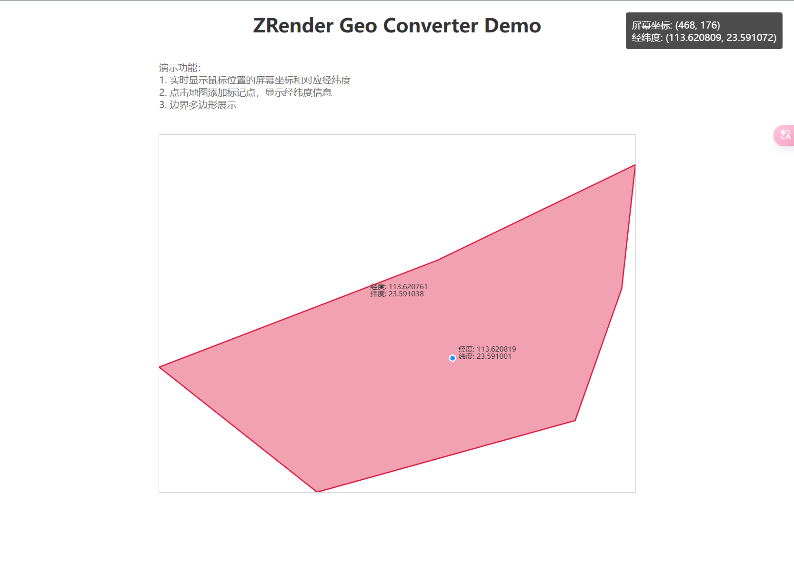

# ZRender Geo Converter

English | [简体中文](./README.md)

A utility library for converting between ZRender screen coordinates and geographic coordinates (WGS84).



## Features

- Convert between geographic coordinates (longitude/latitude) and screen coordinates
- Support GeoJSON data conversion
- Easy event coordinate conversion
- Lightweight with minimal dependencies
- TypeScript support

## Installation

```bash
npm i zrender-geo-converter
```
